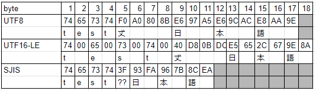
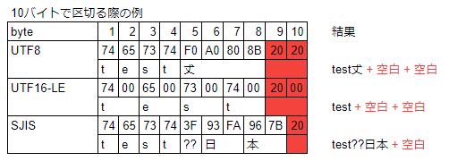

# GetFixBytes
Powershell用の文字固定長バイト区切り関数です。

SubStringや、GetBytesを使用したサンプルはいくつかありますが
SJISやUTF-16のサロゲートが考慮されておらず、文字が途切れるため
正しい文字境界で区切る関数を作成しました。

| 文字 | UTF8        | UTF16-LE    | SJIS      |
| ---- | ----------- | ----------- | --------- |
| t    | 74          | 74 00       | 74        |
| e    | 65          | 65 00       | 65        |
| s    | 73          | 73 00       | 73        |
| t    | 74          | 74 00       | 74        |
| 𠀋   | F0 A0 80 8B | 40 D8 0B DC | 3F(Error) |
| 日   | E6 97 A5    | E5 65       | 93 FA     |
| 本   | E6 9C AC    | 2C 67       | 96 7B     | 
| 語   | E8 AA 9E    | 9E 8A       | 8C EA     |





### パラメータ
* $text string
	バイト配列にする文字を含む文字列
* $count int
	バイト配列にするバイト数
* $enc_dst System.Text.Encoding
	文字コードによって一文字のバイト数が異なるため、最初に出力したい文字列のEncodingを指定します。
* padding_str string
	対象の文字が途切れた場合に代わりに詰める文字を指定
	デフォルトは、空白

### 戻り値
* Byte[]
	指定した文字のセットをエンコードした結果を格納しているバイト配列。

### 例
``` powershell
# Sample 1
$enc_dst = [System.Text.Encoding]::GetEncoding('UTF-16')
$dst_bytes = GetFixBytes "test𠀋日本語" 11 $enc_dst "*"
[System.IO.File]::WriteAllBytes(".\write.txt", $dst_bytes)
```